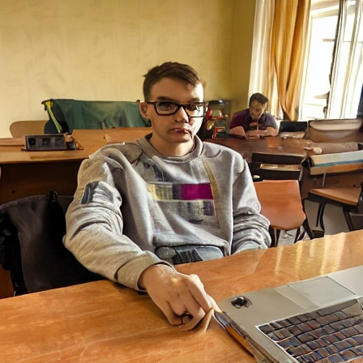
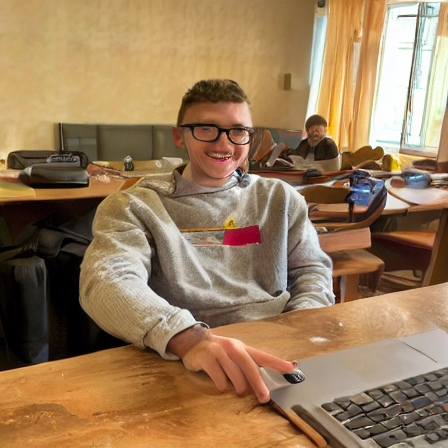
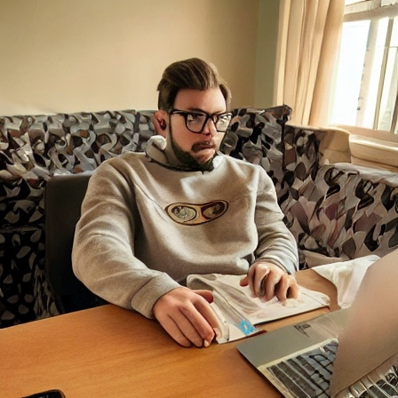
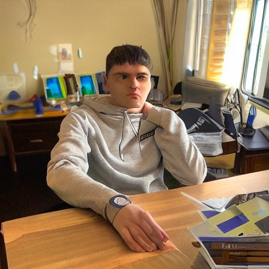
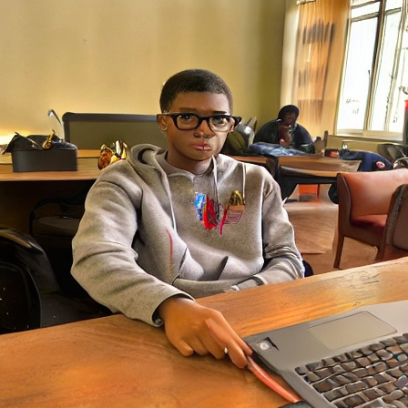

## The MOST exciting and accurate zero-shot classification algorithm from the project! ##

Implementation of the noise-denoise zero-shot classification algorithm. It is so easy and fun to use! That is how:

```bash
require 'redcarpet'
markdown = Redcarpet.new("Hello World!")
puts markdown.to_html
```
## Real-world example. Try it yourself! ##

In all cases diffusion model successfully classified Dan. In the cases of glasses CLIP missclassified him.

|  | | |
|:--:| :--:|:--:|
| *Real Dan* |*A photo of a sad young man*|*A photo of a happy young man*|

|  | | |
|:--:| :--:|:--:|
| *Real Dan* |*A photo of a young man with glasses*|*A photo of a young man without glasses*|

|  | | |
|:--:| :--:|:--:|
| *Real Dan* |*A photo of a white young man*|*A photo of a black young man*|
